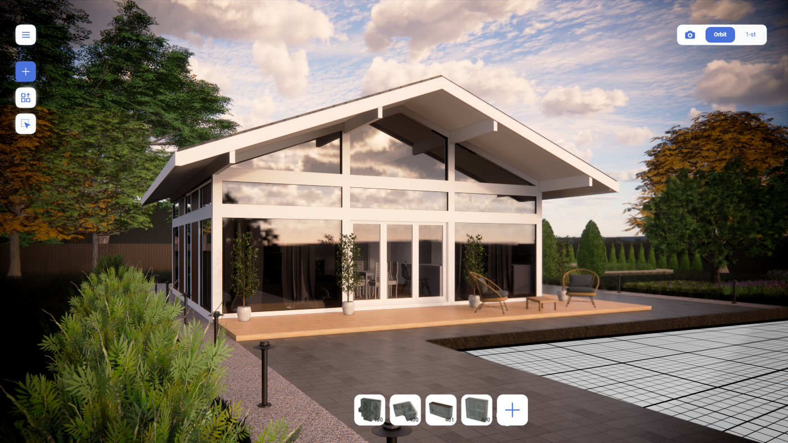

# Avvyland overview

## A brief introduction

Avvyland is a no-code framework for building a network of **immersive DApps** aka **IDApps**. That is to say, Avvyland is a system where users create DApps in a game-like way. This is why we call an IDApp user a player.

### What is an IDApp? 

IDApp is the core component of Avvyland designed to work with active 3D content. It is a space where players immersively create virtual worlds by building and programming 3D objects. 

An IDApp includes the following components: 

 - Brane (see the term below), 
 - 3D objects including the user’s avatar.

> Term: Brane is a 3D space where the user is present as an avatar (Avvy) and can build their virtual world. 

### How an IDApp works? 

IDApps are processed by a node specifically designed by Avvyland. The node is a multicomponent engine that allows setting the behaviour of 3D objects using a no-code programming language. 

This way, everything added onto an IDApp can behave the way set by user-generated rules. The rules are set by simple visual operators that look like little bricks of logic.

Once the user created a rule for an object, the thin client sends the rule to the node. The node executes it, applies changes in the IDApp, and submits the data on the executed rule to the public blockchain. 

The entire procedure is performed using an open-source protocol designed by Avvyland. It is a multi-purpose open-source protocol that can be used by advanced participants to create their entities and arrange them in their custom way.

### How was IDApp developed?

Today’s IT industry has two popular trends: immersivity reached by XR and decentralization of blockchain networks. However, both technologies are applied quite narrowly: while immersivity is often used in the entertainment sphere, decentralization mostly relates to crypto commerce. Therefore, we saw a possibility to hybridize these trends to design a conceptually new product. On one hand, this product allows creating 3D content with a full immersion into a virtual reality; on the other hand, it is commercialized in a peer-to-peer way and functions as a DApp with all its advantages from financial and informational safety to the flexibility of development.

We named this product an immersive DApp (IDApp) and formulated the following system requirements (SRS). An immersive DApp should:

 - Contain a ledger for recording transactions involving any asset

 - Be capable of processing hierarchical 3D data

 - Make use of thin AR clients

 - Enable realization of any use case

 - Allow intuitive creation of any content

By these SRS, we developed an IDApp that can be created using the Avvyland framework.

### Why did we design it? 

A classical DApp has broad functionality that can be applied in many ways; yet, it is not adapted for broad public use: it requires advanced knowledge like Solidity programming language and high-power hardware. An IDApp is easily created in the Avvyland platform. 

By making DApps easy to use for any participant, Avvyland allows the creation of businesses without specific skills like coding or graphical design, and without any enterprise resource planning (ERP) solutions. I.e., it is an all-in-one tool where the user is equipped with everything to start a business from scratch. 

In Avvyland, users can fill an IDApp with content, and they can also create IDApps on their own. We provide open-source protocols and user-friendly services for content creation. It allows users with any background to implement any idea, from narrow-purpose scenarios to self-evolving virtual realities.

## Principles of IDApp work

An IDApp is fueled by:
 - Immersivity
 - Decentralization
 - Economics
 - User-generated content
 - Omni-purposeness
 - Immersivity

### Immersivity

A Brane’s space is immersive because it mirrors the real world. 

The framework’s realistic environment with 3D objects, augmented reality, and intuitive game-based mechanics allow to create content naturally while engaged in the metaverse. 

### Decentralization

Based on Web 3.0, the system controls and regulates itself without any additional moderation. We use a decentralized multi-layer structure to record all actions inside the Brane in the public blockchain. The processing hosts are distributed among the network’s participants which ensures trust between users.

### Economics

Avvyland’s decentralized economics allows users to enter into different P2P relationships with other participants. Therefore, Avvyland can serve as a commercial platform to launch gig economy businesses and reward-gaining activities of any complexity and scale. 

### User-generated content

Every Avvyland object is configurable: its behaviour, properties, and appearance can be set by simple rules via our services for objects creation and programming:

UCS (unified content system) is a step-by-step editor that allows to create or modify objects inside the Brane.

DSL (domain-specific language) is a visual coding tool that allows setting the behaviour and properties of any object.

### Omni-purposeness

Avvyland’s engine is scalable: it allows to create an unlimited number of Branes and users. We provide open-source protocols and an intuitive interface to help users with any background implement any idea for any activity: game design, business, art, education, etc.

## Implementation 

A Brane is a virtual space with a life-like environment and user-generated content. To interact with Branes, we developed two thin clients: a mobile AR application and a web VR client.

The mobile app functions in the AR mode and provides users with the most immersive experience.

The web app can be accessed from PC, tablets, phones, or other devices and is excellent for professional activities.

## Ways to use Branes

The decentralized system’s functionality and Avvyland’s intuitive immersive environment make it possible to engage in diverse activities and fulfil many roles. You can search for items in marketplace Branes and buy them, or launch a marketplace of your own. You can play a friend’s game or design a new one. You can create full-fledged works of art and sell them as NFTs or create small craft items as a hobby.

It is all possible without coding or design skills. Here are just a few of the basic use cases available in Avvyland.

### For Developers

#### App design

Each Brane serves as a separate app. Avvyland’s no-code visual programming allows configuring app behaviour and populating realities with an unlimited number of smart objects. 

#### Game dev

It is possible to build gaming worlds using various 3D objects and world generating procedures or populate these worlds with creatures and characters and set them up with any desirable rules. 

### For Creators

#### Art

Setting up art galleries anywhere in the world, composing artworks and installations are possible through designing blocks with external editors and loading them into Avvyland. 

Digital artists and established musicians can monetize their art through Branes by placing their work in the Branes and selling it to other Avvyland residents as NFTs.

#### Design & Architecture

Architects and designers can model buildings, houses, and other structures with blocks and objects that have real-world prototypes. As a Brane resident, an architect can collaborate on the project design with customers, contractors, designers, and colleagues face-to-face (avvy-to-avvy). Anyone from the team can automatically generate a bill of materials, estimate strength and energy efficiency, and get assembly instructions at any design stage. Digital goods are available for physical implementation using DomiDo technology which offers standardized production of any object.

    

### For entrepreneurs

#### Trade

A Brane can be set up as a marketplace – a supermarket, shop, or showroom – where digital and physical goods are sold for cryptocurrency. An original AI-based 3D scanning feature allows creating product avatars and adding them to the store. It is possible to use Avvyland’s native smart contract engine or attach the backend of an existing store via a simple API.

#### Advertisement

Avvyland makes it possible to place advertising objects in any physical space which is purchased by Brane’s user. This will grant the user an exclusive privilege to make their Brane the only publicly visible Brane in this area. There is a broad selection of ad tools, from static banners to interactive games and theme parks.
